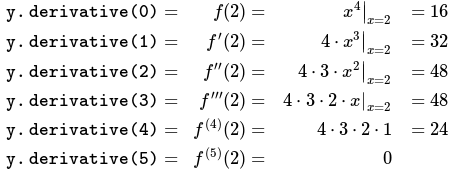
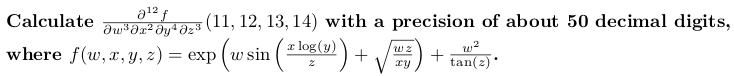

# Autodiff - Automatic Differentiation C++ Library

### Build Status

Branch          | Travis | Appveyor | codecov.io |
:-------------: | ------ | -------- | ---------- |
[`master`](https://github.com/pulver/autodiff/tree/master) | [](https://travis-ci.com/pulver/autodiff) | [](https://ci.appveyor.com/project/pulver/autodiff/branch/master) | [](https://codecov.io/gh/pulver/autodiff)
[`develop`](https://github.com/pulver/autodiff/tree/develop) | [](https://travis-ci.com/pulver/autodiff) | [](https://ci.appveyor.com/project/pulver/autodiff/branch/develop) | [](https://codecov.io/gh/pulver/autodiff/branch/develop)

## Description

Autodiff is a header-only C++ library that facilitates the [automatic
differentiation](https://en.wikipedia.org/wiki/Automatic_differentiation) (forward mode) of mathematical functions
of single and multiple variables.

This implementation is based upon the [Taylor series](https://en.wikipedia.org/wiki/Taylor_series) expansion of
an analytic function *f* at the point *x₀*:

&nbsp; &nbsp; &nbsp; &nbsp; &nbsp; &nbsp; 

The essential idea of autodiff is the substitution of numbers with polynomials in the evaluation of *f(x₀)*. By
substituting the number *x₀* with the first-order polynomial *x₀+ε*, and using the same algorithm to compute
*f(x₀+ε)*, the resulting polynomial in *ε* contains the function's derivatives *f'(x₀)*, *f''(x₀)*,
*f'''(x₀)*, ... within the coefficients. Each coefficient is equal to the derivative of its respective order,
divided by the factorial of the order.

In greater detail, assume one is interested in calculating the first *N* derivatives of *f* at *x₀*. Without
loss of precision to the calculation of the derivatives, all terms *O(ε<sup>N+1</sup>)* that include powers of
*ε* greater than *N* can be discarded. (This is due to the fact that each term in a polynomial depends only
upon equal and lower-order terms under arithmetic operations.) Under these truncation rules, *f* provides a
polynomial-to-polynomial transformation:

&nbsp; &nbsp; &nbsp; &nbsp; &nbsp; &nbsp; 

C++'s ability to overload operators and functions allows for the creation of a class `fvar` that represents
polynomials in *ε*. Thus the same algorithm *f* that calculates the numeric value of *y₀=f(x₀)*, when
written to accept and return variables of a generic (template) type, is also used to calculate the polynomial
*Ʃ<sub>n</sub>y<sub>n</sub>εⁿ=f(x₀+ε)*. The derivatives *f<sup>(n)</sup>(x₀)* are then found from the
product of the respective factorial *n!* and coefficient *y<sub>n</sub>*:

&nbsp; &nbsp; &nbsp; &nbsp; &nbsp; &nbsp; 


### Example 1: Single-Variable Differentiation


``` c++
#include <boost/math/differentiation/autodiff.hpp>
#include <iostream>

template <typename T>
T fourth_power(T const& x) {
  T x4 = x * x;  // retval in operator*() uses x4's memory via NRVO.
  x4 *= x4;      // No copies of x4 are made within operator*=() even when squaring.
  return x4;     // x4 uses y's memory in main() via NRVO.
}

int main() {
  using namespace boost::math::differentiation;

  constexpr unsigned Order = 5;                  // Highest order derivative to be calculated.
  auto const x = make_fvar<double, Order>(2.0);  // Find derivatives at x=2.
  auto const y = fourth_power(x);
  for (unsigned i = 0; i <= Order; ++i)
    std::cout << "y.derivative(" << i << ") = " << y.derivative(i) << std::endl;
  return 0;
}
/*
Output:
y.derivative(0) = 16
y.derivative(1) = 32
y.derivative(2) = 48
y.derivative(3) = 48
y.derivative(4) = 24
y.derivative(5) = 0
*/
```

The above calculates



### Example 2: Multi-Variable and Multi-Precision Differentiation



``` c++
#include <boost/math/differentiation/autodiff.hpp>
#include <boost/multiprecision/cpp_bin_float.hpp>
#include <iostream>

using namespace boost::math::differentiation;

template <typename W, typename X, typename Y, typename Z>
promote<W, X, Y, Z> f(const W& w, const X& x, const Y& y, const Z& z) {
  using namespace std;
  return exp(w * sin(x * log(y) / z) + sqrt(w * z / (x * y))) + w * w / tan(z);
}

int main() {
  using float50 = boost::multiprecision::cpp_bin_float_50;

  constexpr unsigned Nw = 3;  // Max order of derivative to calculate for w
  constexpr unsigned Nx = 2;  // Max order of derivative to calculate for x
  constexpr unsigned Ny = 4;  // Max order of derivative to calculate for y
  constexpr unsigned Nz = 3;  // Max order of derivative to calculate for z
  // Declare 4 independent variables together into a std::tuple.
  auto const variables = make_ftuple<float50, Nw, Nx, Ny, Nz>(11, 12, 13, 14);
  auto const& w = std::get<0>(variables);  // Up to Nw derivatives at w=11
  auto const& x = std::get<1>(variables);  // Up to Nx derivatives at x=12
  auto const& y = std::get<2>(variables);  // Up to Ny derivatives at y=13
  auto const& z = std::get<3>(variables);  // Up to Nz derivatives at z=14
  auto const v = f(w, x, y, z);
  // Calculated from Mathematica symbolic differentiation.
  float50 const answer("1976.319600747797717779881875290418720908121189218755");
  std::cout << std::setprecision(std::numeric_limits<float50>::digits10)
            << "mathematica   : " << answer << '\n'
            << "autodiff      : " << v.derivative(Nw, Nx, Ny, Nz) << '\n'
            << std::setprecision(3)
            << "relative error: " << (v.derivative(Nw, Nx, Ny, Nz) / answer - 1) << '\n';
  return 0;
}
/*
Output:
mathematica   : 1976.3196007477977177798818752904187209081211892188
autodiff      : 1976.3196007477977177798818752904187209081211892188
relative error: 2.67e-50
*/
```

### Example 3: Black-Scholes Option Pricing with Greeks Automatically Calculated

``` c++
#include <boost/math/differentiation/autodiff.hpp>
#include <iostream>

using namespace boost::math::constants;
using namespace boost::math::differentiation;

// Equations and function/variable names are from
// https://en.wikipedia.org/wiki/Greeks_(finance)#Formulas_for_European_option_Greeks

// Standard normal cumulative distribution function
template <typename X>
X Phi(X const& x) {
  return 0.5 * erfc(-one_div_root_two<X>() * x);
}

enum class CP { call, put };

// Assume zero annual dividend yield (q=0).
template <typename Price, typename Sigma, typename Tau, typename Rate>
promote<Price, Sigma, Tau, Rate> black_scholes_option_price(CP cp,
                                                            double K,
                                                            Price const& S,
                                                            Sigma const& sigma,
                                                            Tau const& tau,
                                                            Rate const& r) {
  using namespace std;
  auto const d1 = (log(S / K) + (r + sigma * sigma / 2) * tau) / (sigma * sqrt(tau));
  auto const d2 = (log(S / K) + (r - sigma * sigma / 2) * tau) / (sigma * sqrt(tau));
  switch (cp) {
    case CP::call:
      return S * Phi(d1) - exp(-r * tau) * K * Phi(d2);
    case CP::put:
      return exp(-r * tau) * K * Phi(-d2) - S * Phi(-d1);
  }
}

int main() {
  double const K = 100.0;                    // Strike price.
  auto const S = make_fvar<double, 2>(105);  // Stock price.
  double const sigma = 5;                    // Volatility.
  double const tau = 30.0 / 365;             // Time to expiration in years. (30 days).
  double const r = 1.25 / 100;               // Interest rate.
  auto const call_price = black_scholes_option_price(CP::call, K, S, sigma, tau, r);
  auto const put_price = black_scholes_option_price(CP::put, K, S, sigma, tau, r);

  std::cout << "black-scholes call price = " << call_price.derivative(0) << '\n'
            << "black-scholes put  price = " << put_price.derivative(0) << '\n'
            << "call delta = " << call_price.derivative(1) << '\n'
            << "put  delta = " << put_price.derivative(1) << '\n'
            << "call gamma = " << call_price.derivative(2) << '\n'
            << "put  gamma = " << put_price.derivative(2) << '\n';
  return 0;
}
/*
Output:
black-scholes call price = 56.5136
black-scholes put  price = 51.4109
call delta = 0.773818
put  delta = -0.226182
call gamma = 0.00199852
put  gamma = 0.00199852
*/
```

See [example/black\_scholes.cpp](example/black_scholes.cpp) for a larger list of automatically-calculated
option greeks.

## Advantages of Automatic Differentiation
The above examples illustrate some of the advantages of using autodiff:

* Elimination of code redundancy. The existence of *N* separate functions to calculate derivatives is a form
  of code redundancy, with all the liabilities that come with it:
    * Changes to one function require *N* additional changes to other functions. In the 3rd example above,
      consider how much larger and inter-dependent the above code base would be if a separate function were
      written for [each Greek](https://en.wikipedia.org/wiki/Greeks_(finance)#Formulas_for_European_option_Greeks)
      value.
    * Dependencies upon a derivative function for a different purpose will break when changes are made to
      the original function. What doesn't need to exist cannot break.
    * Code bloat, reducing conceptual integrity. Control over the evolution of code is easier/safer when
      the code base is smaller and able to be intuitively grasped.
* Accuracy of derivatives over finite difference methods. Single-iteration finite difference methods always include
  a *Δx* free variable that must be carefully chosen for each application. If *Δx* is too small, then numerical
  errors become large. If *Δx* is too large, then mathematical errors become large.  With autodiff, there are
  no free variables to set and the accuracy of the answer is generally superior to finite difference methods even
  with the best choice of *Δx*.

## Manual

Additional details are in the [autodiff manual](doc/latex/autodiff.pdf).

### License

Distributed under the [Boost Software License, Version 1.0](http://www.boost.org/LICENSE_1_0.txt).

### Properties

* Header-only.
* Optimized for C++17. Also compiles and tested with the C++11, C++14 and proposed C++20 standards.
* All memory is allocated on the stack.

### Directories

| Name        | Purpose                        |
| ----------- | ------------------------------ |
| `doc`       | documentation                  |
| `example`   | examples                       |
| `include`   | headers                        |
| `test`      | unit tests                     |

### More information

<!-- * [Ask questions](http://stackoverflow.com/questions/ask?tags=c%2B%2B,boost,boost-template) -->
* [Report bugs](https://github.com/pulver/autodiff/issues): Be sure to mention Boost version, platform and compiler you're using. A small compilable code sample to reproduce the problem is always good as well.
* Submit your patches as pull requests against the [develop](https://github.com/pulver/autodiff/tree/develop) branch. Note that by submitting patches you agree to license your modifications under the [Boost Software License, Version 1.0](http://www.boost.org/LICENSE_1_0.txt).
<!-- * Discussions about the library are held on the [Boost developers mailing list](http://www.boost.org/community/groups.html#main). Be sure to read the [discussion policy](http://www.boost.org/community/policy.html) before posting and add the `[template]` tag at the beginning of the subject line. -->
